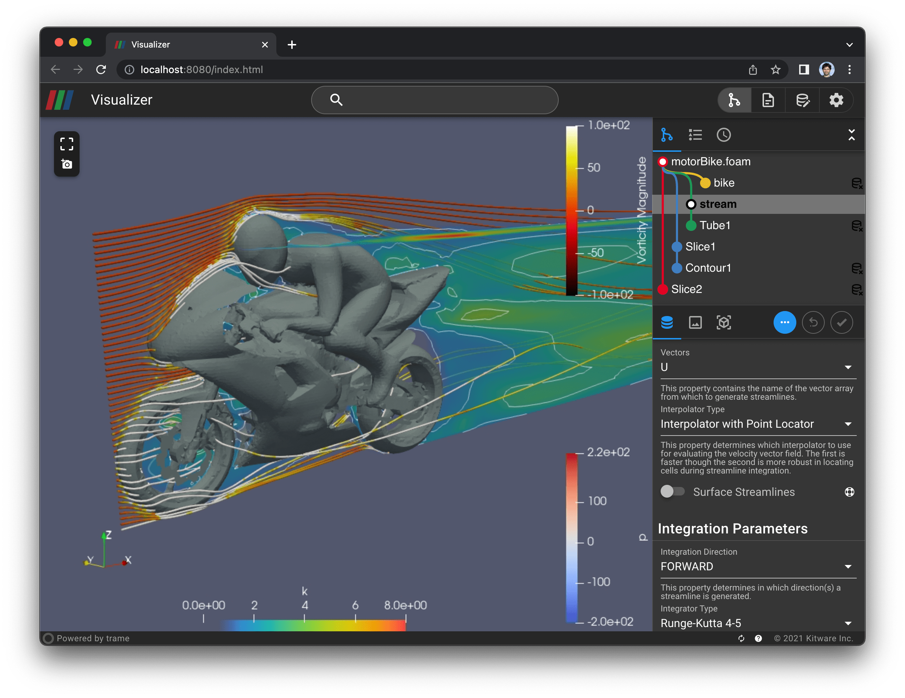
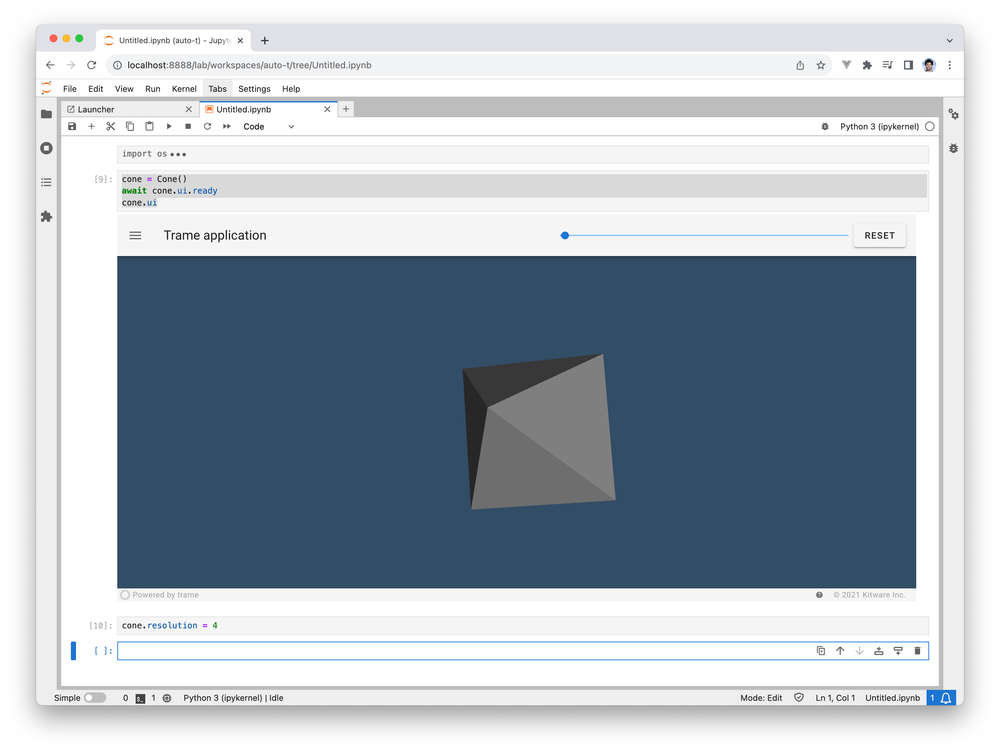

# trame

Trame is a Python library designed for creating efficient, web-based interactive user interfaces. With Trame, you can define your entire UI directly in Python, effortlessly managing the underlying client-server architecture. Built on Vue.js, Trame seamlessly integrates with Vue.js or any JavaScript library, offering flexibility and power for your application’s frontend.

## Run everywhere

A Trame application can run seamlessly across various environments: locally, in the cloud, on HPC systems with ParaView, or within Jupyter notebooks.

## Want to learn more

Head to the [main website to learn more about trame](https://kitware.github.io/trame/).

<iframe
    style="width: 100%; height: 500px;"
    src="https://player.vimeo.com/video/764741737?h=bd3c37ebfb&title=0&byline=0&portrait=0&muted=1&autoplay=1&loop=1&background=1"
    frameborder="0"
    allow="autoplay;"
    allowfullscreen
    muted
>
</iframe>